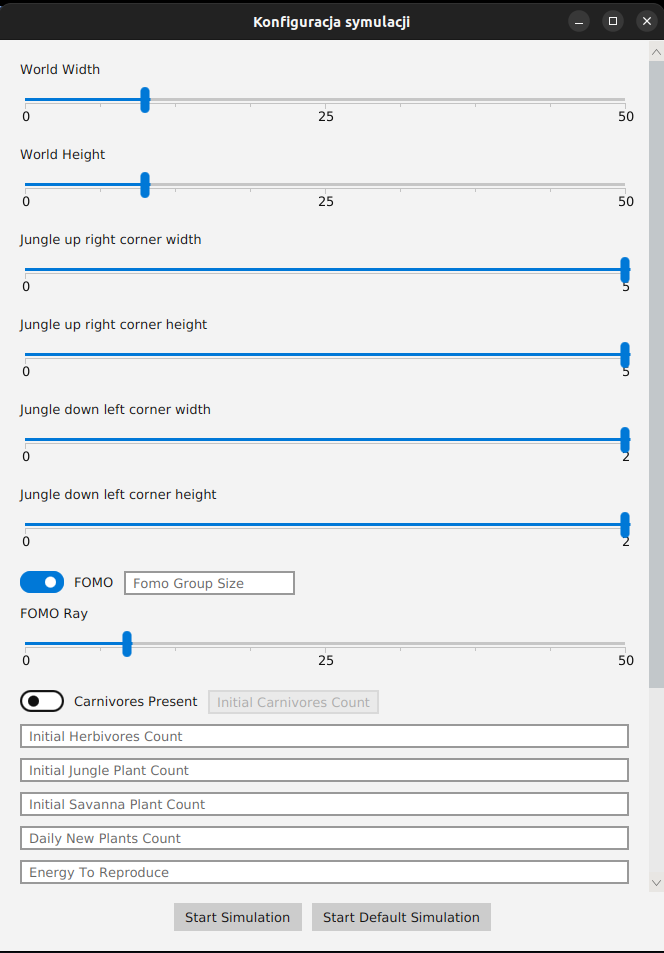
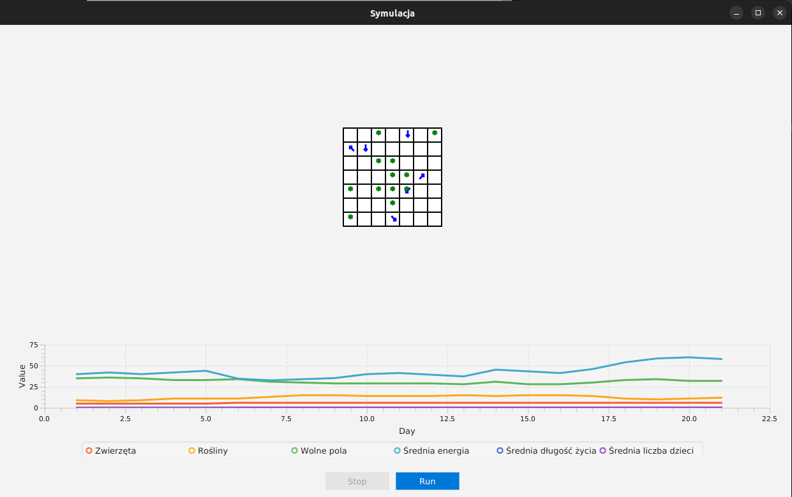

# Darwin-darwin.World-2.0
This project implements an evolutionary simulation where autonomous animals move around a grid-based world, search for food, reproduce, and mutate over generations.
Simple genetic rules drive behavior, leading to emergent population dynamics, natural selection, and the gradual evolution of diverse survival strategies within the ecosystem.

## Screenshots

### Simulation view

### Statistics panel
